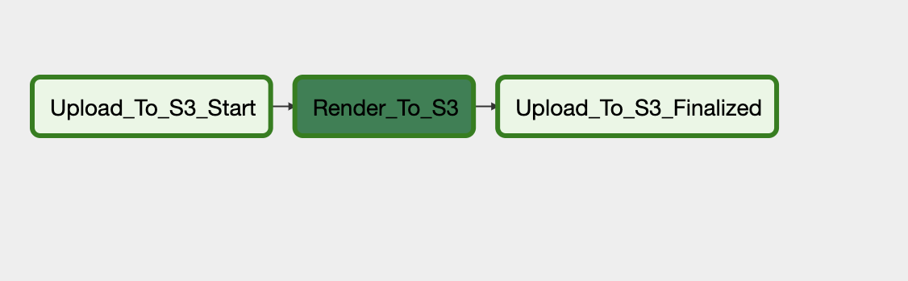
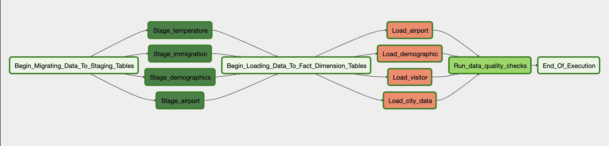

# Airflow Data Engineer (ETL) Project: 
## 목표
이번 프로젝트의 목적은 다양한 도시에 대한 온도, 인구 및 이민 통계와 함꼐 DA, DS, 다른 연구원들에게 제공할만한 ETL 파이프라인을 구축하는 것입니다.

먼저 여러 데이터 셋에서 온도, 공항, 인구 및 이민 통계 데이터를 추출하고 spark를 활용하여 json으로 변환을 하여 Redshift DB에 적제합니다.

그 이후 Apache Airflow를 활용하여 json file을 s3로 마이그레이션된 데이토가 Redshift로 업로드 되고, 추가 변환을 거쳐 정규화 및 dimension 테이블로 로드 됩니다.

## Database Model
### City Fact Table

| Table Column | Data Type | Description |
| -------- | ------------- | --------- |
| city_id (PRIMARY_KEY) | varchar(32)  | auto generated primary key|
|  city_name | varchar(32) | name of city |
| country | varchar(32) | name of country |
| latitude | varchar(10) | latitude value |
| longitude | varchar(10) | longitude value |
| average_temperature | numeric |  average temperature of the city |
| date | date | date of temperature recording |

### Airport Dimension Table

| Table Column | Data Type | Description |
| ------------ | ---------- | --------- |
| airport_id (PRIMARY_KEY) | varchar(50)  | auto generated primary key|
|  airport_code | varchar(50) | airport short code |
| name | varchar(500) | name of airport |
| continent | varchar(50) | continent code |
| country_code | varchar(32) | country code |
| state | varchar(32) |  state code |

### Visitor Dimension Table

| Table Column             | Data Type     | Description |
| -------------------------| ------------- | ----------- |
| visitor_id (PRIMARY_KEY) | varchar(32)   | auto generated primary key|
|  year                    | int4          | year of visit |
| month                    | int4          | month of visit|
| city                     | varchar(32)   | city of visit |
| gender                   | varchar(32)   | gender of visitor |
| arrival_date             | date          |  arrival date of the visitor |
| departure_date           | date          |  departure time of the visitor |
| airline                  | varchar(32)   |  airline code |

### Demographic Dimension Table

| Table Column | Data Type | Description |
| ---------------------------- | ------------- | ------------------------- |
| demographic_id (PRIMARY_KEY) | varchar(100)  | auto generated primary key|
|  city                        | varchar(50)   | city name                 |
| state                        | varchar(50)   | state code                |
| male_population              | int4          | male population numbers by city |
| female_population | int4 | female population numbers by city |
| total_population | int4 |  total population numbers by city |

### Reasons for the model
I settled on the above model since I found that the common data field from all the various datasets is city and with that I could be able to extrapolate the other data fields that I required for the data pipeline. With the fact and dimension tables, I utilized the star schema which is more suitable and optimized for OLAP (Online Analytical Processing) operations.

## Tools and Technologies used
- __Apache Spark__ - Big data || csv file의 데이터를 DataFrame으로 처리하고 json으로 변환하는 곳에 사용하였습니다. DataSet의 열을 Table에 필요한 열에 매핑하였습니다.
- __Apache Airflow__ - Spark에 처리된 json file을 로컬파일에서 S3로 업로드하고, 데이터 확인 및 dimension 테이블 생성하고 S3 파일을 Redshift 스테이징 테이블에 복사한 다음 ETL을 수행하여 데이터를 테이블에 로드하였습니다.
- __Amazon Redshift__ - s3 데이터와 dimension 테이블에 추가되는 최종 데이터를 저장합니다.
- __Amazon S3__ - Spark로 처리된 json파일을 저장합니다.

### DAGs Airflow Graph View Representation
#### File Upload DAG

#### Load Transform in Redshift DAG

